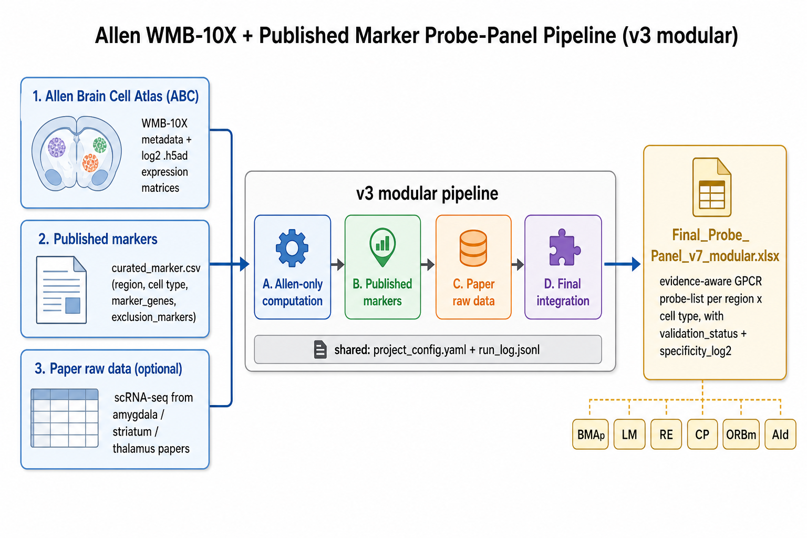
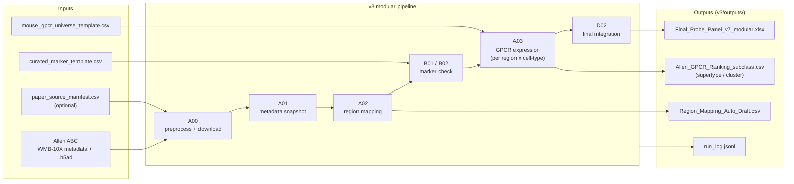
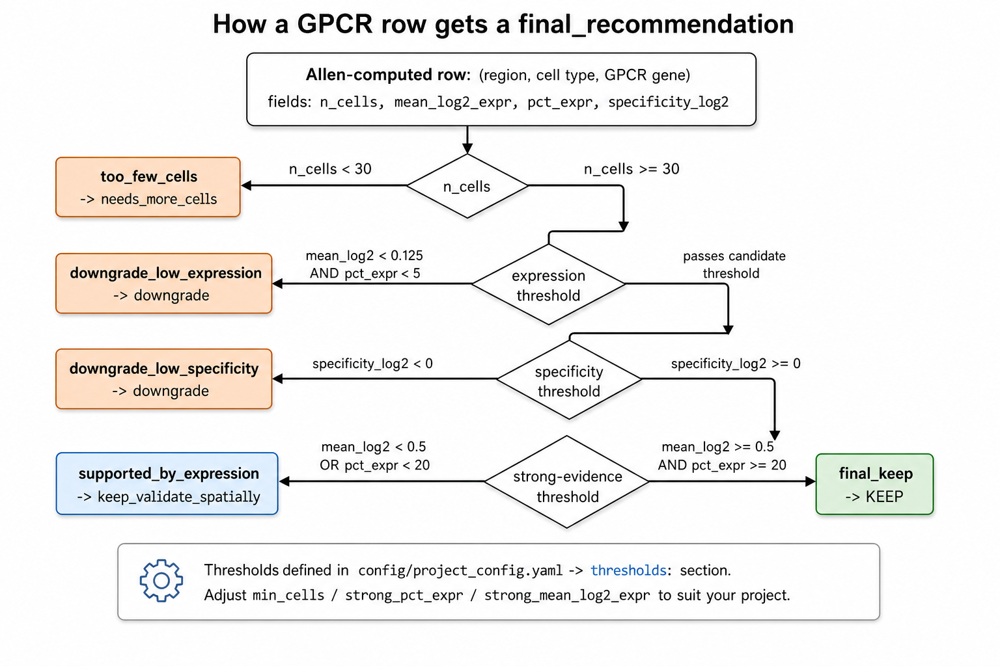
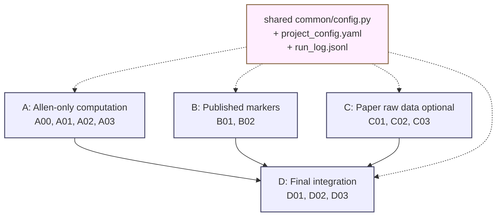

# Genelist analysis (Allen WMB-10X)

Defensible, evidence-aware GPCR / cell-type marker probe planning for **seven mouse brain regions** (BMAp, LM, RE, CP, ORBm, AId, **CA**), built by **combining** [Allen Brain Cell Atlas](https://alleninstitute.github.io/abc_atlas_access/) WMB-10X single-cell data with curated published-literature GPCR suggestions. Both data sources are used **together**, not against each other — every recommended GPCR is tagged with the evidence (paper, Allen, or both) that supports it.



> ## I just want the answer — which probes do I order?
>
> **Open this ONE file (4 sheets, everything in one place):**
> - [`outputs/FINAL_decision.xlsx`](outputs/FINAL_decision.xlsx) ← top-level mirror
> - [`v3/outputs/FINAL_decision.xlsx`](v3/outputs/FINAL_decision.xlsx) ← canonical
>
> ```
> Sheet 1  HOW_TO_READ           Legend explaining the 4 sheets.
> Sheet 2  FINAL_Recommendations  Conclusions only - 53 rows (one per (region, cell_type,
>                                 anchor)). cell-type markers + GPCR panel + 1 drug per
>                                 gene + ORDER/SPATIAL/EXCLUSION verdict + role column.
>                                 Covers all 24 cell types from the original v6 input
>                                 plus CA region.
> Sheet 3  Decision_Table_full    Drilldown - 53 rows x 16 cols with metrics, paper vs
>                                 Allen reasoning, DrugBank IDs, FDA NDA, PubMed PMIDs.
> Sheet 4  GPCR_Drug_References   Long drug-citation table - 94 rows x 13 cols, one row
>                                 per drug with DrugBank URL + PubMed URL + FDA app.
> ```
>
> **Coverage (24 cell types across 7 regions):**
>
> | Region | Targets (probe candidates) | Exclusion counter-stains |
> |---|---|---|
> | **CP** | D1 SPN, D2 SPN, Patch/striosome SPN, Matrix/exopatch SPN, Cholinergic IN, PV/SST/NPY IN | — |
> | **BMAp** | Posterior BMA glut VGLUT1-like, BMA/MEA VGLUT2-like | Amygdala GABA / striatal-like neighbors |
> | **RE** | Midline thalamic glut / reuniens | Reticular/inhibitory thalamic |
> | **LM** | Lateral mammillary excitatory | Nearby hypothalamic populations |
> | **ORBm** | L2/3 IT, L5 IT/L5 ET-PT, L6 CT/L6b, Cortical IN | — |
> | **AId** | Upper-layer IT, Deep-layer output, Cortical IN | — |
> | **CA** | CA1, CA2, CA3, DG granule | — |
>
> Exclusion rows have `role = exclusion_counterstain` and `what_to_do = "EXCLUSION COUNTER-STAIN"` (grey-shaded). Their markers (e.g. `Gad1, Gnb3, Pvalb` for RE reticular) are meant for confirming you are NOT looking at that cell, not for probe ordering.
>
> Use sheet 2 for at-a-glance ordering. Sheet 3 when you need the reasoning. Sheet 4 to look up additional drugs.
>
> ### FINAL_Recommendations sheet (sheet 2) - column breakdown
>
> | Column | Color | Meaning |
> |---|---|---|
> | `cell_type_marker_genes` | 🟠 orange | Curated **positive** marker genes for the cell type (defines which cells you're looking at). |
> | `exclusion_markers` | grey | Markers that should NOT be co-expressed. |
> | `recommended_GPCR_panel` | 🔵 blue | Top 5 GPCR probes to order, ranked by tier |
> | `recommended_drugs_per_gene` | 🟣 purple | One drug per gene, marked `(FDA YEAR)` / `(clinical-trial)` / `(research)` / `(EU-only)` |
> | `evidence_tier_per_gene` | grey | `paper+allen_keep` > `allen_only_keep` > `paper+allen_broadly_detectable` > `allen_only_broadly_detectable` |
> | `what_to_do` | 🟢 green | `ORDER` (cell-type-specific) / 🟡 yellow `ORDER WITH SPATIAL CONSTRAINT` (broadly detectable only) / 🟠 orange `REVIEW` (no picks) |
>
> Sample rows:
>
> | region | cell_type | cell_type_marker_genes | recommended_GPCR_panel | recommended_drugs_per_gene | what_to_do |
> |---|---|---|---|---|---|
> | CP | D1 SPN | Drd1, Isl1, Pdyn, Tac1 | Drd1, Grm1, Htr1b, Chrm4, Cnr1 | Drd1: Apomorphine (FDA) \| Htr1b: Sumatriptan (FDA 1992) \| **Chrm4: Xanomeline (FDA 2024)** \| Cnr1: Dronabinol (FDA 1985) | ORDER |
> | CP | Cholinergic IN | Chat, Slc18a3, Slc5a7 | Gabbr1, Chrm2, Oprm1, Tacr3, Oprd1 | Chrm2: Donepezil (FDA 1996) \| **Tacr3: Fezolinetant (FDA 2023)** | ORDER |
> | CA | CA1 | Fibcd1, Mpped1, Pou3f1, Slc17a7, Spink8, Wfs1 | Htr1a, Mc4r, Gabbr1, Gabbr2, Grm1 | Htr1a: Buspirone (FDA 1986) \| **Mc4r: Setmelanotide (FDA 2020)** | ORDER |
> | CA | CA2 | **Amigo2, Avpr1b, Cacng5, Map3k15, Pcp4, Rgs14, Slc17a7** | Avpr1b, Gabbr1, Gabbr2, Grm5 | Avpr1b: Nelivaptan (clinical-trial) | ORDER |
> | RE | Reuniens (PVT-PT) | Calb2, Pcp4, Slc17a6, Spon1, Tcf7l2 | Oprk1, Galr1, Oxtr, Cnr1, Oprm1 | **Oprk1: Difelikefalin (FDA 2021)** \| Cnr1: Dronabinol (FDA 1985) | ORDER |
> | BMAp | Posterior BMA Glut | C1ql2, Cartpt, Dcn, Gpr101, Meis2, Slc17a7 | Gabbr1, Gabbr2, Grm5, Npy2r | Gabbr1: Baclofen (FDA 1977) \| Grm5: Mavoglurant (clinical-trial) | ORDER WITH SPATIAL CONSTRAINT |
> | CA | DG granule | C1ql2, Calb1, Dock10, Dsp, Prox1, Slc17a7 | Grm1, Grm5 | Grm1: research \| Grm5: clinical-trial | ORDER WITH SPATIAL CONSTRAINT |
>
> ### Drilldown level 2 — full evidence + sources (sheet 3 of `FINAL_decision.xlsx`)
>
> **Need the reasoning behind each pick (metrics, specificity, paper-vs-Allen comparison, drug DrugBank IDs/PubMed PMIDs)?** That's **sheet 3 (`Decision_Table_full`) of the same `FINAL_decision.xlsx` file** linked above. 18 rows × 15 columns. Key columns:
>
> | Column | Color | Meaning |
> |---|---|---|
> | `paper_suggested_gpcrs` | 🟡 yellow | Literature-curated genes for this cell type |
> | `allen_validated_top_picks` | 🟢 green | Cell-type-specific genes (Allen `keep` tier: spec > 0, strong expression) |
> | **`combined_GPCRs_for_probe`** | 🔵 **blue** | **UNION sorted by evidence strength**: `paper+allen_keep` → `allen_only_keep` → `paper+allen_broadly_detectable` → `allen_only_broadly_detectable` → `paper_only_allen_downgrade`. **Each gene also lists FDA-approved drugs and clinical/research compounds inline.** |
> | `combined_evidence_summary` | 🟠 orange | Compact summary of which genes were kept and why |
> | `n_GPCRs_keep` | grey | Count of cell-type-specific picks (gold tier) |
> | `n_broadly_detectable` | grey | Count of broadly-expressed reliable-signal picks (use only if region/spatial is constrained) |
> | **`existing_drugs_for_picks`** | 🟣 **purple** | **Per-gene drug-target ledger** (compact): FDA-approved drugs, clinical/research compounds, indication. Built from `v3/inputs/gpcr_drug_targets.csv`. |
> | **`drugs_with_sources_per_picks`** | 🟣 **dark purple** | **Same drugs WITH citations**: DrugBank ID + URL, FDA NDA/BLA application number, key PubMed PMID + URL. Format `DrugName [status, year] -> indication :: DrugBank: DBxxxx (URL) ; FDA: NDA xxxxx ; PMID:yyyyy (URL)`. Built from `v3/inputs/gpcr_drug_targets_detailed.csv` (long-format, one row per drug, 94 rows × 13 cols). |
>
> ### Two evidence tiers (NEW)
>
> The original strict tier required `specificity_log2 > 0` (cell-type-specific). For regions like **BMAp / RE / DG** that express high-abundance neuronal GPCRs (Grm5, Gabbr1/2, Grm1) at very high levels (log2 ≥ 8, pct = 100%) but only slightly less than other subclasses, this returned **zero picks**. To fix that without lowering the gold-standard bar:
>
> - **Tier 1 — `keep` (cell-type-specific)** — original gold standard. `spec_log2 > 0` AND strong expression. Best for cell-type-discriminating probes.
> - **Tier 2 — `broadly_expressed_detectable` (NEW)** — `pct ≥ 50%` AND `log2 ≥ 4` AND `spec_log2 ≥ -2`. Reliable FISH signal, but the gene is also expressed elsewhere; only safe to use if your dissection / AAV / ROI already restricts the region.
>
> Both tiers feed `combined_GPCRs_for_probe`, tagged so you can tell them apart at a glance.
>
> Need GitHub preview without download? See [`v3/outputs/FINAL_decision_table_combined_with_sources.csv`](v3/outputs/FINAL_decision_table_combined_with_sources.csv) (mirror of sheet 3).
>
> Need the FULL evidence ledger (every Allen subclass × every gene)? Open [`outputs/Final_Probe_Panel_v7_modular.xlsx`](outputs/Final_Probe_Panel_v7_modular.xlsx) — 14 sheets including the master `Final_Probe_Panel` (154,869 rows) and `Computed_GPCR_subclass/supertype/cluster` rankings.
>
> **Want to run the pipeline?** Follow [`v3/docs/STEP_BY_STEP.md`](v3/docs/STEP_BY_STEP.md) (one-page playbook).

---

## What's in this repo

| Folder / file | What it is |
|---|---|
| **`v3/`** | **Current modular pipeline (recommended)**. Four modules (A/B/C/D), shared config, run logs, schematic diagrams. |
| **`outputs/FINAL_decision.xlsx`** | **🎯 THE FILE TO OPEN. 4 sheets, 32 KB. Sheet 2 = conclusions (markers + GPCR panel + drug per gene + ORDER verdict). Sheet 3 = drilldown with sources. Sheet 4 = drug citation table.** |
| `v3/outputs/FINAL_decision.xlsx` | Same as above (canonical location). |
| `outputs/FINAL_Recommendations.xlsx` | Standalone copy of the conclusions sheet (kept for backward compat). |
| `v3/outputs/FINAL_Recommendations.xlsx` | Same. |
| `v3/outputs/FINAL_Recommendations.csv` | GitHub-renderable preview of the conclusions table. |
| `outputs/FINAL_decision_table_combined_with_sources.xlsx` | Standalone copy of the drilldown sheet (kept for backward compat). |
| `v3/outputs/FINAL_decision_table_combined_with_sources.xlsx` | Same. |
| `v3/outputs/FINAL_decision_table_combined_with_sources.csv` | GitHub-renderable preview with sources. |
| `v3/outputs/Final_Probe_Panel_v7_modular.xlsx` | Full 7-region probe-selection workbook (14 sheets: **`FINAL_Recommendations`** (conclusions, second sheet), `Final_Summary`, `Paper_GPCR_Suggestions`, **`GPCR_Drug_Targets`** (wide), **`GPCR_Drug_References`** (long, with sources), full per-subclass evidence ledger). |
| `v3/inputs/gpcr_drug_targets.csv` | Wide drug-target table for 39 GPCRs (compact: drugs / mechanism / indication). |
| `v3/inputs/gpcr_drug_targets_detailed.csv` | **Long-format drug reference table (94 rows × 13 cols)**: one row per (gene, drug). Columns: `gene_symbol, iuphar_receptor, drug_name, drug_status, drug_class, year_approved_or_published, indication, drugbank_id, drugbank_url, fda_application, key_pmid, pubmed_url, notes`. 62 FDA-approved entries, 32 clinical/research. |
| `outputs/Final_Probe_Panel_v7_modular.xlsx` | Identical mirror of the full workbook. |
| `v3/outputs/Final_Summary_v7_with_paper.csv` | Older standalone export of `Final_Summary` (kept for diff). |
| `v3/outputs/Final_Summary.csv` | Even older 14-row preview from before paper integration (kept for diff). |
| `v3/inputs/celltype_to_subclass_anchor.csv` | Curated mapping from your cell-type labels (e.g. *D1 SPN*) to the exact Allen subclass IDs (e.g. *061 STR D1 Gaba*). Drives the `Final_Summary` sheet. |
| `v3/inputs/paper_gpcr_suggestions.csv` | (region × cell_type × gene → paper_source) curated from Hochgerner 2023, Märtin 2019, Gokce 2016, Smith 2019 NP-GPCR, Hitti 2014 / Pagani 2015 (CA2), and IUPHAR. |
| `v3/inputs/mouse_gpcr_universe_template.csv` | **39 GPCR universe** (was 22; added Htr1a/1b/2a, Gpr6/52, Tacr1/3, Ntsr1/2, Hcrtr1/2, Oxtr, Avpr1a/1b ← CA2 KEY, Crhr1, Galr1, Mc4r). |
| `v3/outputs/gpcr_full/Allen_GPCR_Ranking_*.csv` | Per-level (subclass / supertype / cluster) GPCR ranking with `specificity_log2`. |
| `v3/docs/STEP_BY_STEP.md` | One-page command playbook, end-to-end. |
| `v3/docs/images/` | Schematic figures (the ones in this README). |
| `v3/config/project_config.yaml` | Cache path, manifest pin, region list, all thresholds. |
| Top-level `gpcr_rank_patch_v6.py`, `build_final_probe_table.py`, `run_all.ps1` | Legacy v6/v7 monolithic scripts (kept for reproducibility — superseded by `v3/`). |

---

## Pipeline overview (high-level)



---

## How a GPCR row gets a final recommendation



Every row in `Final_Probe_Panel` is a `(region_user, cell-type, GPCR gene)` combination. The script walks each row through 4 thresholds (all configurable in `v3/config/project_config.yaml`) and assigns:

| `final_recommendation` | Meaning | What to do |
|---|---|---|
| `keep` | strong expression and cell-type-specific (`spec_log2 > 0` AND strong expression) | order probe (gold tier) |
| `keep_validate_spatially` | passes minimum thresholds | order, but verify with MERFISH/HCR |
| `candidate_to_validate` | borderline | needs more evidence |
| `downgrade` | low expression OR low specificity (ubiquitous) | drop unless there's a literature reason |
| `needs_more_cells` | n_cells < 30 | not enough power; revisit with deeper data |

The `specificity_log2` column = (group mean log2) − (max log2 across other groups in the same region). Positive = enriched in this cell type; large positive = great probe candidate.

### Why a second tier was added (broadly_expressed_detectable)

Before adding this tier, regions like **BMAp / RE / DG** had **zero** picks even though they expressed broad neuronal GPCRs (Grm5, Gabbr1/2, Grm1) at near-saturating levels (log2 ≥ 8, pct = 100%). The reason: `spec_log2` was slightly negative (e.g. -0.7 to -1.5), meaning some other subclass had marginally higher expression. These genes are still **excellent FISH probes** if you have any spatial constraint (dissection, AAV, ROI). The new tier surfaces them explicitly:

| Anchor | Tier-1 keep | Tier-2 broadly_detectable |
|---|---:|---:|
| BMAp 012 MEA Slc17a7 Glut | 0 | **4** (Grm5, Gabbr1, Gabbr2, Npy2r) |
| RE 152 RE-Xi Nox4 Glut | 0 | **4** (Grm5, Gabbr1, Gabbr2, Grm1) |
| LM 144 MM Foxb1 Glut | 0 | **3** |
| CA DG 037 DG Glut | 0 | **2** (Grm1, Grm5) |
| CA CA2 025 CA2-FC-IG Glut | 0 → **1** | 3 (incl. Avpr1b inline) |

Adjust thresholds in `v3/config/project_config.yaml`:

```yaml
thresholds:
  strong_pct_expr: 20         # Tier 1 keep
  strong_mean_log2_expr: 0.5
  broad_min_pct_expr: 50      # Tier 2 broadly_detectable
  broad_min_mean_log2_expr: 4.0
  broad_min_specificity_log2: -2.0
```

### Drug-target column (NEW)

Each gene in `combined_GPCRs_for_probe` and the dedicated `existing_drugs_for_picks` column is annotated with FDA-approved + clinical/research drugs from a curated 39-GPCR table (`v3/inputs/gpcr_drug_targets.csv`). Highlights from the union picks across the 7 regions:

| Gene | FDA-approved | Clinical relevance |
|---|---|---|
| `Drd1` / `Drd2` | Apomorphine, Pergolide; Risperidone, Olanzapine, Aripiprazole, Haloperidol, Levodopa+Carbidopa, Bromocriptine, Pramipexole | Parkinson's, schizophrenia |
| `Adora2a` | Istradefylline (Nourianz, FDA 2019) | Parkinson's adjunct |
| `Cnr1` | Dronabinol (Marinol/THC), Nabilone, CBD | Anti-emesis, appetite, epilepsy |
| `Gabbr1`/`Gabbr2` | Baclofen, Sodium oxybate (Xyrem) | Spasticity, narcolepsy |
| `Chrm4` | **Xanomeline (KarXT/Cobenfy, FDA Sept 2024)** | First non-D2 antipsychotic |
| `Tacr1` | Aprepitant, Fosaprepitant | Chemo-induced nausea |
| `Tacr3` | Fezolinetant (Veozah, FDA 2023) | Menopause hot flashes |
| `Sstr2` | Octreotide, Lanreotide, Lutetium Lu-177 dotatate | Acromegaly, NETs |
| `Hcrtr1`/`Hcrtr2` | Suvorexant, Lemborexant, Daridorexant | Insomnia |
| `Mc4r` | Setmelanotide (Imcivree, FDA 2020) | Genetic obesity |
| `Htr1b` | Triptan class (Sumatriptan etc.) | Migraine |
| `Htr2a` | Pimavanserin, Risperidone; Psilocybin (FDA breakthrough) | Parkinson psychosis, depression |
| `Oprm1`/`Oprk1` | Morphine, Methadone, Buprenorphine; Difelikefalin (FDA 2021) | Pain, uremic pruritus |

Full table: open the `GPCR_Drug_Targets` sheet in `Final_Probe_Panel_v7_modular.xlsx` or `v3/inputs/gpcr_drug_targets.csv`.

### Drug citations (NEW)

Every drug in the inline `drugs_with_sources_per_picks` cell, and every row of the new `GPCR_Drug_References` workbook sheet (94 rows × 13 cols), is linked to:

- **DrugBank ID + URL** (e.g. Difelikefalin → `DB12550` → `https://go.drugbank.com/drugs/DB12550`).
- **FDA application number** for landmark / recent approvals (e.g. Xanomeline KarXT → `NDA 217336`, Cobenfy 2024-09-26).
- **Key PubMed PMID + URL** for the pivotal phase-2/3 trial or characterization paper (e.g. Setmelanotide → `PMID:32027842` Clément et al. *Lancet Diabetes Endocrinol* 2020; Suvorexant → `PMID:24502879` Michelson et al. *Lancet Neurol* 2014; Pimavanserin → `PMID:24411054` Cummings et al. *Lancet* 2014; Fezolinetant → `PMID:36924778` Lederman et al. *Lancet* 2023 SKYLIGHT 1/2; Lasmiditan → `PMID:30736028` Goadsby et al. *Brain* 2019; Difelikefalin → `PMID:32268027` Fishbane et al. *NEJM* 2020 KALM-1; Daridorexant → `PMID:34648391` Mignot et al. *Lancet Neurol* 2022).

Sample row (CA1 pyramidal, Htr1a section, from `drugs_with_sources_per_picks`):

```
== Htr1a ==
Buspirone [FDA-approved, 1986] -> generalized anxiety disorder
   ::  DrugBank: DB00490 (https://go.drugbank.com/drugs/DB00490)
Vortioxetine [FDA-approved, 2013] -> major depression
   ::  DrugBank: DB09068 (https://go.drugbank.com/drugs/DB09068) ; FDA: NDA 204447
Gepirone (Exxua) [FDA-approved 2023, 2023] -> major depression (non-sexual-dysfunction profile)
   ::  DrugBank: DB04948 (https://go.drugbank.com/drugs/DB04948) ; FDA: NDA 021164
```

For drugs whose receptor-pharmacology citation is older than easy PMID retrieval (most pre-2000 mu-opioid analgesics, triptans), only the DrugBank link is given — DrugBank itself contains the full mechanism, target affinity, and reference list.

---

## Quick start (Windows PowerShell)

```powershell
# 0) Install
pip install -r requirements.txt

# 1) (optional) override cache location
$env:ABC_ATLAS_CACHE = "D:\abc_atlas_cache"

# 2) Run the v3 pipeline end-to-end (see v3/docs/STEP_BY_STEP.md for full commands)
$ROOT = "$PWD\v3"; $OUT = "$ROOT\outputs"
python "$ROOT\A_Allen_only_computational_module\A00_preprocess_download.py"          --out_dir "$OUT\preprocess"
python "$ROOT\A_Allen_only_computational_module\A01_setup_cache_and_metadata.py"     --out_dir "$OUT\metadata"
python "$ROOT\A_Allen_only_computational_module\A02_region_mapping_merfish_ccf.py"   --out_dir "$OUT\region_mapping"
python "$ROOT\B_Published_marker_input_module\B01_standardize_published_markers.py"  --markers_csv "$ROOT\inputs\curated_marker_template.csv" --out_dir "$OUT\markers"
python "$ROOT\B_Published_marker_input_module\B02_validate_marker_presence_in_allen.py" --cache_dir "$env:ABC_ATLAS_CACHE" --marker_long_csv "$OUT\markers\Published_Cell_Marker_Long.csv" --out_dir "$OUT\markers"
python "$ROOT\A_Allen_only_computational_module\A03_allen_gpcr_expression.py"        --out_dir "$OUT\gpcr_full" --gpcr_csv "$ROOT\inputs\mouse_gpcr_universe_template.csv" --region_mapping_csv "$OUT\region_mapping\Region_Mapping_Auto_Draft.csv" --levels subclass supertype cluster
python "$ROOT\D_Final_integration_module\D02_create_final_probe_workbook.py"         --out_xlsx "$OUT\Final_Probe_Panel_v7_modular.xlsx" --allen_subclass_csv "$OUT\gpcr_full\Allen_GPCR_Ranking_subclass.csv" --allen_supertype_csv "$OUT\gpcr_full\Allen_GPCR_Ranking_supertype.csv" --allen_cluster_csv "$OUT\gpcr_full\Allen_GPCR_Ranking_cluster.csv" --published_marker_csv "$OUT\markers\Published_Cell_Marker_Long.csv" --region_mapping_csv "$OUT\region_mapping\Region_Mapping_Auto_Draft.csv"
```

End-to-end on a warm cache (87 GiB of `.h5ad` matrices already downloaded): roughly **5 minutes** for the heavy A03 step + 30 s for D02.

---

## Module architecture



- **A. Allen-only computation** — talks to the Allen S3 bucket via `abc_atlas_access`, pulls metadata + log2 `.h5ad`, computes per-region × per-cell-type means / pct / specificity / ranks for a curated GPCR panel.
- **B. Published markers** — converts a hand-curated marker CSV into a long table and verifies every gene actually exists in Allen's gene metadata.
- **C. Paper raw data (optional)** — template adapters for paper-specific scRNA-seq datasets (figshare / ArrayExpress); included for future expansion.
- **D. Final integration** — joins A + B + C, applies thresholds from `project_config.yaml`, and writes the final workbook.
- All four modules read the same `project_config.yaml` and append to the same `run_log.jsonl` for full provenance.

---

## What was actually run for the published outputs

| Step | Result |
|---|---|
| A00 preprocess | manifest pinned (`releases/20240330`), Allen metadata + ROI + taxonomy snapshotted |
| A02 region mapping | 6/6 user labels resolved automatically (BMAp→sAMY, LM→HY, RE→TH, CP→STRd, ORBm→PL-ILA-ORB, AId→AI) |
| B01 / B02 | 55/55 curated marker genes confirmed present in Allen gene metadata |
| A03 GPCR expression | 904,742 cells × 22 GPCRs × 6 regions × 3 taxonomy levels = 80,652 ranking rows in 224 s |
| D02 final workbook | 24.6 MB `.xlsx` with 8 sheets, including `Final_Probe_Panel` with `validation_status` + `final_recommendation` + `specificity_log2` |

Top-of-list `keep` candidates per region (subclass-level, by combined rank):
- **CP**: `Gpr88`, `Grm5` in `061 STR D1 Gaba` / `062 STR D2 Gaba` (canonical SPN markers)
- **ORBm / AId**: `Cnr1` in `047 Sncg Gaba` (cortical interneuron canonical)
- **BMAp**: `Cnr1`, `Grm1`
- **LM (HY)**: `Adcyap1r1` in astroependymal NN, `Adora2a` in `331 Peri NN`
- **RE (TH)**: `Adcyap1r1` in `321 Astroependymal NN`, `Htr2c` in choroid plexus, `Gpr88` in `061 STR D1 Gaba`

These match well-established striatal and cortical-interneuron biology, so the pipeline is finding real signal.

---

## Legacy v6 / v7 pipeline (also kept here for reference)

The original monolithic scripts (`gpcr_rank_patch_v6.py`, `wmb_enrich_probe_workbook_v7.py`, `allen_v6_workbook_audit.py`, `build_final_probe_table.py`) are still in the repository root, with their original `run_all.ps1` runner. Their final deliverable is `outputs/mouse_6_region_GPCR_probe_FINAL_panel_with_resources.xlsx`. Use these only if you need to reproduce the legacy run; for new work, use `v3/`.

---

## References

- [Allen ABC Atlas access — getting started](https://alleninstitute.github.io/abc_atlas_access/notebooks/getting_started.html)
- [Allen ABC Atlas — selection example](https://alleninstitute.github.io/abc_atlas_access/notebooks/abc_atlas_selection_example.html)
- [Allen Brain Cell Atlas (data portal)](https://portal.brain-map.org/atlases-and-data/bkp/abc-atlas)

## License & attribution

Source code in this repository is released for academic use. All Allen Institute / ABC Atlas data carry the [Allen Institute terms of use](https://alleninstitute.org/legal/terms-use/); please cite the WMB whole-brain atlas paper when using the computed expression results.
