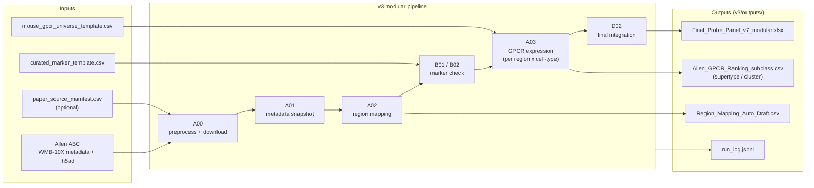
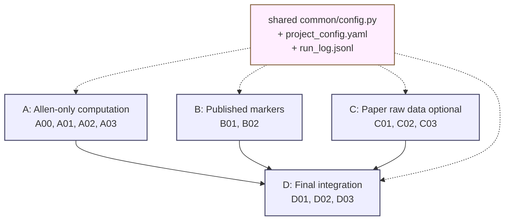

# Genelist analysis (Allen WMB-10X)

Defensible, evidence-aware GPCR / cell-type marker probe planning for **seven mouse brain regions** (BMAp, LM, RE, CP, ORBm, AId, **CA**), built on the [Allen Brain Cell Atlas](https://alleninstitute.github.io/abc_atlas_access/) WMB-10X data plus curated published markers, with **paper-suggested vs. Allen-computed** GPCRs shown side-by-side.


> ## I just want the answer — which probes do I order?
>
> 1. **Download** either copy of the same workbook (49 MB, 11 sheets):
>    - [`outputs/Final_Probe_Panel_v7_modular.xlsx`](outputs/Final_Probe_Panel_v7_modular.xlsx) ← top-level mirror
>    - [`v3/outputs/Final_Probe_Panel_v7_modular.xlsx`](v3/outputs/Final_Probe_Panel_v7_modular.xlsx) ← canonical
> 2. **Open it in Excel** and go to the **second tab from the left**, named **`Final_Summary`** (tab order: `README → Final_Summary → Region_Mapping_Final → CellType_Subclass_Anchors → Paper_GPCR_Suggestions → Computed_GPCR_subclass → … → Final_Probe_Panel`).
> 3. That sheet is one row per **(region × cell type)** — 18 rows across 7 regions (BMAp, LM, RE, CP, ORBm, AId, CA-CA1/CA2/CA3/DG) — with these columns:
>    - `cell_type_marker_genes` — curated **+ markers** to use for the cell type (e.g. *Drd1, Tac1, Pdyn* for D1 SPN; *Avpr1b, Rgs14, Amigo2* for CA2)
>    - `exclusion_markers` — markers that **must be off** (e.g. *Adora2a, Drd2, Penk* for D1 SPN)
>    - **`paper_suggested_gpcrs`** — every GPCR the literature flagged for this cell type (alphabetical)
>    - **`top_GPCRs_to_choose`** — Allen-computed GPCRs that **pass** the keep / validate-spatially thresholds
>    - `top_GPCRs_by_expression` — fallback ranked by raw mean expression (for cell types where nothing passed)
>    - **`agreement_paper_vs_allen`** — `both: …` (paper and Allen agree) | `paper_only: gene(status, spec, log2)` (paper said yes, Allen downgraded — so verify with FISH if you really want it) | `allen_only_keep: …` (Allen found it but paper missed it — interesting new candidates)
>    - `warning` — flagged when no GPCR passed thresholds
> 4. Don't see these columns? You're on the old workbook. Re-download from one of the two links above (look for size **~49 MB**, not 24 or 13 MB).
>
> Want a quick GitHub-rendered preview without downloading? See [`v3/outputs/Final_Summary_v7_with_paper.csv`](v3/outputs/Final_Summary_v7_with_paper.csv) (18 rows × 14 columns, GitHub renders CSVs natively).
>
> **Full evidence ledger** lives in the `Final_Probe_Panel` sheet of the same workbook (**154,869 rows × 23 columns**) with `validation_status`, `final_recommendation`, `specificity_log2`, `paper_suggested` (TRUE/FALSE) and `paper_source` (which paper) per (region × subclass × GPCR).
>
> **Want to run the pipeline?** Follow [`v3/docs/STEP_BY_STEP.md`](v3/docs/STEP_BY_STEP.md) (one-page playbook).

---

## What's in this repo

| Folder / file | What it is |
|---|---|
| **`v3/`** | **Current modular pipeline (recommended)**. Four modules (A/B/C/D), shared config, run logs, schematic diagrams. |
| `v3/outputs/Final_Probe_Panel_v7_modular.xlsx` | **Final 7-region probe-selection workbook (11 sheets including `Final_Summary` + `Paper_GPCR_Suggestions`).** |
| `outputs/Final_Probe_Panel_v7_modular.xlsx` | Identical mirror of the file above, kept at the top level so it's easy to find. |
| `v3/outputs/Final_Summary_v7_with_paper.csv` | Standalone export of the new `Final_Summary` sheet (18 rows × 14 cols, includes `paper_suggested_gpcrs` and `agreement_paper_vs_allen`). Renders directly on GitHub. |
| `v3/outputs/Final_Summary.csv` | Older 14-row preview from before paper integration (kept for diff). |
| `v3/inputs/celltype_to_subclass_anchor.csv` | Curated mapping from your cell-type labels (e.g. *D1 SPN*) to the exact Allen subclass IDs (e.g. *061 STR D1 Gaba*). Drives the `Final_Summary` sheet. |
| `v3/inputs/paper_gpcr_suggestions.csv` | (region × cell_type × gene → paper_source) curated from Hochgerner 2023, Märtin 2019, Gokce 2016, Smith 2019 NP-GPCR, Hitti 2014 / Pagani 2015 (CA2), and IUPHAR. |
| `v3/inputs/mouse_gpcr_universe_template.csv` | **39 GPCR universe** (was 22; added Htr1a/1b/2a, Gpr6/52, Tacr1/3, Ntsr1/2, Hcrtr1/2, Oxtr, Avpr1a/1b ← CA2 KEY, Crhr1, Galr1, Mc4r). |
| `v3/outputs/gpcr_full/Allen_GPCR_Ranking_*.csv` | Per-level (subclass / supertype / cluster) GPCR ranking with `specificity_log2`. |
| `v3/docs/STEP_BY_STEP.md` | One-page command playbook, end-to-end. |
| `v3/docs/images/` | Schematic figures (the ones in this README). |
| `v3/config/project_config.yaml` | Cache path, manifest pin, region list, all thresholds. |
| Top-level `gpcr_rank_patch_v6.py`, `build_final_probe_table.py`, `run_all.ps1` | Legacy v6/v7 monolithic scripts (kept for reproducibility — superseded by `v3/`). |

---

## Pipeline overview (high-level)



---

## How a GPCR row gets a final recommendation


Every row in `Final_Probe_Panel` is a `(region_user, cell-type, GPCR gene)` combination. The script walks each row through 4 thresholds (all configurable in `v3/config/project_config.yaml`) and assigns:

| `final_recommendation` | Meaning | What to do |
|---|---|---|
| `keep` | strong expression and cell-type-specific | order probe |
| `keep_validate_spatially` | passes minimum thresholds | order, but verify with MERFISH/HCR |
| `candidate_to_validate` | borderline | needs more evidence |
| `downgrade` | low expression OR low specificity (ubiquitous) | drop unless there's a literature reason |
| `needs_more_cells` | n_cells < 30 | not enough power; revisit with deeper data |

The `specificity_log2` column = (group mean log2) − (max log2 across other groups in the same region). Positive = enriched in this cell type; large positive = great probe candidate.

---

## Quick start (Windows PowerShell)

```powershell
# 0) Install
pip install -r requirements.txt

# 1) (optional) override cache location
$env:ABC_ATLAS_CACHE = "D:\abc_atlas_cache"

# 2) Run the v3 pipeline end-to-end (see v3/docs/STEP_BY_STEP.md for full commands)
$ROOT = "$PWD\v3"; $OUT = "$ROOT\outputs"
python "$ROOT\A_Allen_only_computational_module\A00_preprocess_download.py"          --out_dir "$OUT\preprocess"
python "$ROOT\A_Allen_only_computational_module\A01_setup_cache_and_metadata.py"     --out_dir "$OUT\metadata"
python "$ROOT\A_Allen_only_computational_module\A02_region_mapping_merfish_ccf.py"   --out_dir "$OUT\region_mapping"
python "$ROOT\B_Published_marker_input_module\B01_standardize_published_markers.py"  --markers_csv "$ROOT\inputs\curated_marker_template.csv" --out_dir "$OUT\markers"
python "$ROOT\B_Published_marker_input_module\B02_validate_marker_presence_in_allen.py" --cache_dir "$env:ABC_ATLAS_CACHE" --marker_long_csv "$OUT\markers\Published_Cell_Marker_Long.csv" --out_dir "$OUT\markers"
python "$ROOT\A_Allen_only_computational_module\A03_allen_gpcr_expression.py"        --out_dir "$OUT\gpcr_full" --gpcr_csv "$ROOT\inputs\mouse_gpcr_universe_template.csv" --region_mapping_csv "$OUT\region_mapping\Region_Mapping_Auto_Draft.csv" --levels subclass supertype cluster
python "$ROOT\D_Final_integration_module\D02_create_final_probe_workbook.py"         --out_xlsx "$OUT\Final_Probe_Panel_v7_modular.xlsx" --allen_subclass_csv "$OUT\gpcr_full\Allen_GPCR_Ranking_subclass.csv" --allen_supertype_csv "$OUT\gpcr_full\Allen_GPCR_Ranking_supertype.csv" --allen_cluster_csv "$OUT\gpcr_full\Allen_GPCR_Ranking_cluster.csv" --published_marker_csv "$OUT\markers\Published_Cell_Marker_Long.csv" --region_mapping_csv "$OUT\region_mapping\Region_Mapping_Auto_Draft.csv"
```

End-to-end on a warm cache (87 GiB of `.h5ad` matrices already downloaded): roughly **5 minutes** for the heavy A03 step + 30 s for D02.

---

## Module architecture



- **A. Allen-only computation** — talks to the Allen S3 bucket via `abc_atlas_access`, pulls metadata + log2 `.h5ad`, computes per-region × per-cell-type means / pct / specificity / ranks for a curated GPCR panel.
- **B. Published markers** — converts a hand-curated marker CSV into a long table and verifies every gene actually exists in Allen's gene metadata.
- **C. Paper raw data (optional)** — template adapters for paper-specific scRNA-seq datasets (figshare / ArrayExpress); included for future expansion.
- **D. Final integration** — joins A + B + C, applies thresholds from `project_config.yaml`, and writes the final workbook.
- All four modules read the same `project_config.yaml` and append to the same `run_log.jsonl` for full provenance.

---

## What was actually run for the published outputs

| Step | Result |
|---|---|
| A00 preprocess | manifest pinned (`releases/20240330`), Allen metadata + ROI + taxonomy snapshotted |
| A02 region mapping | 6/6 user labels resolved automatically (BMAp→sAMY, LM→HY, RE→TH, CP→STRd, ORBm→PL-ILA-ORB, AId→AI) |
| B01 / B02 | 55/55 curated marker genes confirmed present in Allen gene metadata |
| A03 GPCR expression | 904,742 cells × 22 GPCRs × 6 regions × 3 taxonomy levels = 80,652 ranking rows in 224 s |
| D02 final workbook | 24.6 MB `.xlsx` with 8 sheets, including `Final_Probe_Panel` with `validation_status` + `final_recommendation` + `specificity_log2` |

Top-of-list `keep` candidates per region (subclass-level, by combined rank):
- **CP**: `Gpr88`, `Grm5` in `061 STR D1 Gaba` / `062 STR D2 Gaba` (canonical SPN markers)
- **ORBm / AId**: `Cnr1` in `047 Sncg Gaba` (cortical interneuron canonical)
- **BMAp**: `Cnr1`, `Grm1`
- **LM (HY)**: `Adcyap1r1` in astroependymal NN, `Adora2a` in `331 Peri NN`
- **RE (TH)**: `Adcyap1r1` in `321 Astroependymal NN`, `Htr2c` in choroid plexus, `Gpr88` in `061 STR D1 Gaba`

These match well-established striatal and cortical-interneuron biology, so the pipeline is finding real signal.

---

## Legacy v6 / v7 pipeline (also kept here for reference)

The original monolithic scripts (`gpcr_rank_patch_v6.py`, `wmb_enrich_probe_workbook_v7.py`, `allen_v6_workbook_audit.py`, `build_final_probe_table.py`) are still in the repository root, with their original `run_all.ps1` runner. Their final deliverable is `outputs/mouse_6_region_GPCR_probe_FINAL_panel_with_resources.xlsx`. Use these only if you need to reproduce the legacy run; for new work, use `v3/`.

---

## References

- [Allen ABC Atlas access — getting started](https://alleninstitute.github.io/abc_atlas_access/notebooks/getting_started.html)
- [Allen ABC Atlas — selection example](https://alleninstitute.github.io/abc_atlas_access/notebooks/abc_atlas_selection_example.html)
- [Allen Brain Cell Atlas (data portal)](https://portal.brain-map.org/atlases-and-data/bkp/abc-atlas)

## License & attribution

Source code in this repository is released for academic use. All Allen Institute / ABC Atlas data carry the [Allen Institute terms of use](https://alleninstitute.org/legal/terms-use/); please cite the WMB whole-brain atlas paper when using the computed expression results.
