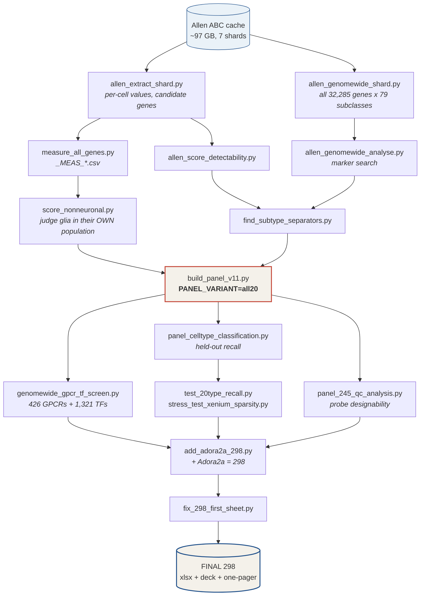

# ORBm + BMAp Xenium panel — pipeline and reasoning

**Deliverable:** a 298-gene standalone 10x Xenium custom panel for two mouse brain regions,
plus the measured evidence for every gene on it.

**Scope of this document:** the **panel design** phase only — how the 298 genes were chosen and
what evidence backs each one. Design frozen 2026-09-19.

**Where this sits in the wider project** (hub: `~/Research_Projects/03_GPCR_probe_panel/`):

| Phase | Status | Document |
|---|---|---|
| 1. Panel design → 298 genes | **frozen 2026-09-19** | **this file** |
| 2. Submission to 10x | 296 of 298 as Ensembl IDs; the 2 transgenes need sequences (4 records, because of the Ai14 STOP-cassette read-through problem) | `SUBMIT_10x_transgene_sequences_README.md` |
| 3. Pilot run already done | `XETG00277__0063817__Region_1__20260923` — XOA 4.0.2.2, **stock mBrain_v1.1 247-gene panel**, fixed-frozen, 93,727 cells, median 126 transcripts/cell. **Not** the custom 298 panel. | `GUIDE_Xenium_Explorer_and_outputs_KR.md` |
| 4. Downstream analysis | designed | `PIPELINE_downstream_ORBm_BMAp.md` (Explorer ROI → ORBm/BMAp) |
| 247 vs 298 comparison | done | `GENES_247_not_on_SUBMIT298_ORBm_BMAp.md` |

Do not read this file as the current state of the whole project — it is the design record.
For what to do with data off the instrument, go to phase 4.

| | |
|---|---|
| Order list | `v3/outputs/FINAL_Xenium_panel_ORBm_BMAp_298genes_FINAL.xlsx` → sheet `SHARED_PANEL_ORDER` |
| Funder deck | `v3/outputs/ORBm_BMAp_Xenium_panel_298_FINAL_HANSOL.pptx` (5 slides, zero images, fully editable) |
| One-page list | `v3/outputs/ORBm_BMAp_298_gene_list_ONE_PAGE.pptx` |
| Reference atlas | Allen Brain Cell Atlas WMB-10X, cached at `~/Downloads/abc_atlas_cache` (~97 GB) |
| Regions | ORBm = ROI `PL-ILA-ORB` (106,122 cells) · BMAp = ROI `sAMY` (120,764 cells) |

---

## 1. What the panel has to do

The experiment is TRAP labelling plus Xenium. TRAP mice — `Fos2A-iCreER` (TRAP2, JAX 030323)
crossed to **`Ai14`** (Rosa26-CAG-LSL-tdTomato, JAX 007908/007914) — receive morphine. Cells
active during that window are permanently marked with tdTomato. Xenium then images both
regions on one section.

Every gene on the panel must serve one of exactly three jobs. A gene that serves none comes
off, however interesting it is.

| | Job | Genes |
|---|---|---|
| **JOB 1** | Read the TRAP tag, so you know which cells were active | `tdTomato`, `iCre` |
| **JOB 2** | Name the cell type of each tdTomato+ cell, known types and new sub-types | ~135 |
| **JOB 3** | Profile that cell type — GPCR, transcription factor, plasticity, IEG, morphine response | ~160 |

This framing is the whole design. It is also what rescued the project from scope creep: an
earlier version carried circadian phase-calling genes, sex-identity genes and pericyte markers
that served none of the three, and removing them *improved* measured accuracy (0.9324 → 0.9370)
because features with no class signal only add noise.

---

## 2. Data sources, in order of trust

| Source | What it is | How it is used |
|---|---|---|
| **Allen WMB-10X** | 32,285 genes × 226,886 cells in the two ROIs | Ground truth. Every gene is re-scored here; nothing is taken on a paper's word. |
| **Jesse Niehaus** | Morphine-dependence DEGs, mPFC, DESeq2 subclass pseudobulk | The morphine axis. 431 screened → 50 kept. |
| **Berg & Scherrer (GSE283418)** | Published 98-gene amygdala spatial panel | BMAp depth. 98 screened → 10 kept. |
| **IUPHAR / DrugBank** | `v3/inputs/gpcr_drug_targets_detailed.csv`, 94 records / 38 genes | Drug-target annotation, and the cross-check that found `Adora2a`. |
| **Published papers** | 13 sources, 9 with a DOI | Candidates only — all re-tested, and **10 of 10 untested published markers failed.** |

---

## 3. Selection rules

These must hold for any future edit.

| Rule | Statement |
|---|---|
| **R1** | A cell-type or sub-type marker needs ≥50% of its own population **and** ≥20pp over the competitors. |
| **R2** | GPCR / TF / plasticity / IEG / morphine genes may be broad, but must clear 50% somewhere in ORBm or BMAp. |
| **R3** | Score every gene in **its own population**, never only across the 20 neuronal anchors. |
| **R4** | SOW-named genes stay regardless of level: `Fos`, `Arc`, `Per2`, `Satb2`, `Oprm1`, `Creb1`, `Adrb1`, `Htr2a` (exactly 8). |
| **R5** | Standalone panel. No free 10x base panel, so every gene is a probe being ordered. |
| **R6** | ORBm = `PL-ILA-ORB`, BMAp = `sAMY`. MEA / CEA / BST are neighbour controls, not BMAp. |
| **R7** | No second marker where one already exists. No sex-identity genes. |

**R1's competitor set is the single most error-prone thing in this project.** See §6.

---

## 4. The pipeline



### 4.1 Extraction — run once per shard

The seven shards are `WMB-10Xv2-Isocortex-1..4`, `WMB-10Xv3-Isocortex-1..2` (these give ORBm)
and `WMB-10Xv3-STR` (this gives BMAp).

```bash
for s in WMB-10Xv2-Isocortex-1 WMB-10Xv2-Isocortex-2 WMB-10Xv2-Isocortex-3 \
         WMB-10Xv2-Isocortex-4 WMB-10Xv3-Isocortex-1 WMB-10Xv3-Isocortex-2 \
         WMB-10Xv3-STR; do
  python v3/E_Planning/allen_extract_shard.py "$s" "v3/outputs/allen_extract/$s.npz"
  python v3/E_Planning/allen_genomewide_shard.py "$s" "v3/outputs/allen_genomewide/$s.npz"
done
```

`allen_extract_shard.py` writes per-cell values for the candidate genes. The `.h5ad` files are
backed CSR, so **row slicing is cheap and column slicing is expensive** — the script streams row
chunks of 6,000 cells and subsets genes in memory. Do not invert that.

`allen_genomewide_shard.py` never materialises a 226,886 × 32,285 matrix. It accumulates, per
group, the nonzero count and summed expression via a sparse indicator matmul, so memory stays at
`n_groups × n_genes`. It emits three taxonomy levels — subclass (where the 20 anchors live),
supertype (125 sub-populations), cluster (506).

### 4.2 Measurement

| Script | Writes | Answers |
|---|---|---|
| `measure_all_genes.py` | `_MEAS_by_subclass.csv`, `_MEAS_by_anchor.csv`, `_MEAS_gene_summary.csv` | Detection % per gene in each of the 79 subclasses and each of the 20 targets |
| `measure_expression_levels.py` | `_MEAS_level_summary.csv` | Mean log2(CPM+1) **level**, not just detection — a gene can be detected widely but expressed weakly |
| `allen_score_detectability.py` | `allen_detectability_all_candidates.xlsx` | Per-anchor detection, **region-restricted** |
| `score_nonneuronal.py` | `NONNEURONAL_scores.xlsx` | Glial and vascular genes scored in their own population, because all 20 anchors are neuronal |
| `allen_genomewide_analyse.py` | `allen_genomewide_marker_search.xlsx` | Best marker for every group, searched over all 32,285 genes |
| `find_subtype_separators.py` | separator tables | Genes that split supertypes inside the big anchors |

> **The region-restriction fix.** `allen_score_detectability.py` originally pooled both ROIs.
> An ORBm anchor means *that subclass in `PL-ILA-ORB`*, and pooling diluted four interneuron
> anchors — `Lamp5` 18.3%, `Vip` 11.8%, `Sst` 3.2%, `Pvalb` 2.1% of their pooled cells came from
> the other region. Fixed; it changed 18 of 443 genes by >1pp, max 10pp, and **0 crossed the 50%
> threshold**, so the conclusions held. The code comment documents it.

### 4.3 Panel construction

```bash
PANEL_VARIANT=all20 python v3/E_Planning/build_panel_v11.py
python v3/E_Planning/make_panel_excel_reference_format.py   # house Excel format
python v3/E_Planning/make_boss_deck_v11.py                  # deck
```

`all20` is the variant where every one of the 20 target types has its own marker ≥50%. Six genes
were added for it: `Tnnc1`, `Adam19`, `Man2a1`, `Chn2`, `Frem3`, `Blnk`.

### 4.4 Validation — the part that matters

```bash
python v3/E_Planning/genomewide_gpcr_tf_screen.py     # completeness
python v3/E_Planning/panel_celltype_classification.py # held-out recall
python v3/E_Planning/panel_gene_importance.py         # per-gene contribution
python v3/E_Planning/test_20type_recall.py            # per-type, not aggregate
python v3/E_Planning/stress_test_xenium_sparsity.py   # Poisson 30% / 10% capture
python v3/E_Planning/panel_245_qc_analysis.py         # probe designability + NCBI symbols
```

`genomewide_gpcr_tf_screen.py` needs `v3/outputs/_gpcr_tf_curated.json`, the curated mouse GPCR
and TF symbol lists. Those were built and cross-checked by independent agents against
IUPHAR/GPCRdb and AnimalTFDB/Lambert 2018, with the reconcile pass removing non-receptors
(`Gpr107`, `Gpr108`, `Gpr137`, `Gpr137b`, `Gpr155`, `Gpr157`) and non-TFs (`Hmga1/2`, `Id1-4`,
`Ier2`, `Hopx`, and 41 others). Olfactory (`Olfr*`), vomeronasal (`Vmn*r`) and bitter-taste
(`Tas2r*`) receptors are intentionally excluded — real GPCRs, but absent from these regions and
they would swamp the screen.

`stress_test_xenium_sparsity.py` exists because every percentage here comes from 10x scRNA-seq,
which sees far more transcripts per cell than Xenium. The numbers are an upper bound. The test
re-runs the comparison under Poisson down-sampling to 30% and 10% capture to check that a large
panel and a lean panel do not diverge once each gene is measured with a tenth of the counts.

### 4.5 The 298th gene

```bash
python v3/E_Planning/add_adora2a_298.py      # edits the deck IN PLACE
python v3/E_Planning/fix_298_first_sheet.py  # rewrites the workbook front sheet
```

`add_adora2a_298.py` **edits the curated deck in place** rather than regenerating it, because
that file carries hand edits — slides removed, wording changed. Never rebuild it from scratch.

---

## 5. What the panel delivers, measured

All figures are from held-out cells or from the full atlas, not from the selection data.

| Claim | Number | How |
|---|---|---|
| All 20 target cell types recovered | **mean recall 0.922**, 18 of 20 ≥0.85 | Multinomial logistic classifier, 75 classes, 56,118 cells capped at 1,200/class, stratified 70/30, 5 seeds |
| Every pair of target types separable | **94 of 94** | All same-region pairs (66 ORBm + 28 BMAp); each has ≥1 gene differing by ≥20pp. Hardest pair `L4/5 IT` vs `L5 IT`, `Cux2` 67% vs 11% = 56pp |
| Dedicated markers per type | **3 to 28, median 6** | Against same-region competitors. Thinnest is `073 MEA-BST Sox6 Gaba` with `Prox1` +35, `Dlx1` +31, `Chn2` +24 |
| Receptor map complete | **0 GPCRs missing** | 426 mouse GPCRs scored; none reaches 50% in a target type with ≥10pp and is absent |
| TF map complete | **2 near-misses, both excluded** | 1,321 TFs scored. `Bcl6` +11.8pp (022 L5 ET already has `Npr3` +20.4pp), `Lhx5` +10.5pp (119 Skor1 already has `Skor1` +51.4pp) |
| Published markers | **10 of 10 rejected** | `Cux1` `Scnn1a` `Crym` `Tcf4` `Reln` `Pax6` `Tshz1` `Cd36` `Fst` `Whrn` |
| Overlap with 10x catalogue panel | **52 of 298** | And 0 of 40 morphine, 0 of 10 circadian, 0 of 9 activity, 0 of 8 Berg/Scherrer genes |

### The two weakest types, stated plainly

`004 L6 IT` (0.708) and `005 L5 IT` (0.694) are the only two below 0.85. Their errors are almost
entirely **internal to the IT family** — 99.4% and 99.7% of misassigned cells are still called an
IT type, and only 1 cell in 360 leaves IT altogether. IT neurons form a continuous transcriptional
gradient across cortical layers, so no gene in the atlas separates them cleanly. For
`073 MEA-BST Sox6 Gaba` no gene in all 32,285 beats a zero margin section-wide (the top hits are
`mt-Co3`, `mt-Atp6`, `Calm1` at 100%/+0.0). **These are limits of brain taxonomy, not of the
panel** — and in Xenium the cortical layer is set by depth, not by transcript.

---

## 6. Traps — every one of these actually happened

Read this section before changing anything.

**The competitor set decides the answer.** "Does this cell type have a marker?" has three
different answers depending on what you compare against:

| Compared against | Answer |
|---|---|
| All 74 other cell types in the section | 4 of 20 |
| The other 19 target types, both regions pooled | 20 of 20, 1–11 markers each |
| The other targets **in the same region** | 20 of 20, 3–28 markers each |

The third is correct, because ORBm and BMAp sit at different places on the slide and are
separated by coordinate before any gene is read. **Always name the comparison.**

**Scoring a gene outside its own population (R3).** `Cx3cr1` read 15% when measured across the 20
neuronal anchors; in microglia it is 100%. `Chat` looked weak; in `058 PAL-STR Gaba-Chol` it is
84%. `Pnoc` read 44%; in `077 CEA-BST Gal Avp Gaba` it is 95%. All three were wrongly cut, then
restored.

**A cell-type name does not imply a marker.** `073 MEA-BST Sox6 Gaba` is named after `Sox6`, but
`Sox6` is 58% there versus **95% in `Pvalb Gaba` and 90% in `Sst Gaba`** — it marks the whole MGE
interneuron lineage. It stays on the panel as a lineage gene, but it is not a separator for `073`.
Same trap as `Cd36` (highest in macrophages), `Scnn1a` (really ependymal) and `Cux1` (higher in
amygdala GABA than in L2/3).

**Ubiquity is fatal for JOB 2 and fine for JOB 3.** `Grin1`, `Gria1-4`, `Camk2a`, `Dlg4`, `Nlgn1`
are in nearly every neuron — that is the point, you read their *level*. An early attempt applied a
ubiquity cut panel-wide and deleted the entire plasticity block. Restrict such cuts to genes whose
only claim is "it appeared in a DEG list".

**Never cut an IEG on baseline detection.** The atlas is resting tissue. `Npas4` at 45% is the
exemption working correctly, not a defect.

**Low regularized coefficient ≠ dispensable.** Removing `Rai14`, `Thsd7b`, `Trhr`, `Tbr1` — all
bottom-ranked individually — cost 0.51 points, because coefficients measure *unique* contribution.
`Slc17a7`, the canonical glutamate marker, scores 0.444 for the same reason.

**Check `n_measured` before comparing two gene lists.** A benchmark once returned *identical*
0.9177 for the 291- and 297-gene panels. Not because they perform the same — because all six genes
that differ between them were missing from the per-cell extraction, so both scored on the same 266
genes. `allen_extract_six.py` exists only to fix that.

**"Zero GPCRs missing" is scoped.** The sweep filtered to genes strong *inside* the 20 targets.
`Adora2a` is 93.9% in `062 STR D2 Gaba` with a +40.2pp margin, but under 20% in every target type,
so the filter passed over it. It took a separate IUPHAR cross-check to surface. Eight other
drug-target genes stay off deliberately: `Chrm4` 2.7%, `Avpr1b` 1.7%, `Avpr1a` 12.3%, `Gpr52`
13.6%, `Hcrtr1` 26.5% are not expressed here; `Tacr3`, `Ntsr1`, `Gpr6` peak outside the two regions.

### Claims removed as indefensible — do not reinstate

- **"96 of 96 sub-populations have a dedicated marker."** Selection-data circularity: the genes
  were chosen to maximise that metric, then scored on the same data. It reads as validation and
  is not.
- **"18 of 20 clear 20pp"** with no competitor set named. See the table above.
- **"The panel can only identify 35% of cells."** That metric demanded one gene with ≥70%
  detection and ≥20pp margin, and scored **23/79 identically for the 178-, 232- and 252-gene
  panels** — insensitive to the panel, so it measures the taxonomy, not the design.

---

## 7. Reproducing from scratch

```bash
conda create -n allen_abc python=3.11
conda activate allen_abc
pip install abc_atlas_access scanpy anndata pandas numpy scipy scikit-learn openpyxl python-pptx
export ABC_ATLAS_CACHE=~/Downloads/abc_atlas_cache   # ~97 GB, download once
```

Then §4.1 → §4.5 in order. Extraction dominates the runtime; everything downstream is minutes.

**Gitignored because regenerable or huge:** `v3/outputs/allen_extract*/`,
`v3/outputs/allen_genomewide/`, `anchor_subtype_cache.npz`, `_cache*.npy`, `_gpcr_tf_curated.json`,
and `v3/outputs/panel_245_qc_sources/` (10+ GB reference genome and NCBI dumps — re-downloadable,
and they will break a `git push` if staged).

---

## 8. Script status

**Live path (run these):** `allen_extract_shard` · `allen_genomewide_shard` ·
`allen_genomewide_analyse` · `allen_score_detectability` · `allen_extract_gapfill` ·
`allen_extract_six` · `measure_all_genes` · `measure_expression_levels` · `measure_subtype_level` ·
`score_nonneuronal` · `find_subtype_separators` · `build_panel_v11` ·
`make_panel_excel_reference_format` · `make_boss_deck_v11` · `genomewide_gpcr_tf_screen` ·
`panel_celltype_classification` · `panel_gene_importance` · `test_20type_recall` ·
`stress_test_xenium_sparsity` · `panel_245_qc_analysis` · `build_297_final_pack` ·
`add_adora2a_298` · `fix_298_first_sheet`

**Superseded — kept for history, do not run.** 69 scripts: every
`build_panel_v{3,5,7,8,9}*`, `build_final_*`, `build_ideal_panel_by_category`,
`build_three_*`, and the ~25 `make_*deck*` / `make_*slides*` builders from earlier panel
versions. Around 18 panel workbooks spanning 166–317 genes exist in `v3/outputs/` and in
`~/Downloads`. **They are superseded, not alternatives.** The order list is the 298 file named at
the top of this document.

One known-broken file: `make_funder_deck_v3_front3.py` references an undefined `F_PAIRS_NOTE`.
It is superseded by the editable-deck builders; it was never repaired.

---

## 9. Open items

- **ACA.** The SOW describes the IT/CT population as ACA·ILA·PL·ORB, but the Allen ROI
  `PL-ILA-ORB` contains no ACA. Hansol has confirmed ACA is **out of scope** — this is a
  section-placement question, not a gene question. Do not raise it again.
- **`Adora2a` is the first gene to drop** if striatal tissue turns out to be out of interest. It
  reads on a neighbouring population, not on ORBm or BMAp identity.
- **Optical crowding.** The top 10 genes carry 39% of panel transcripts (`Nrxn3` 7.5%, `Nrxn1`
  6.5%, `Syt1` 5.5%, `Nlgn1` 4.8%) and are detected in ~65 of 75 types, so they carry almost no
  typing information. That is the cut order if a run comes back crowded.
